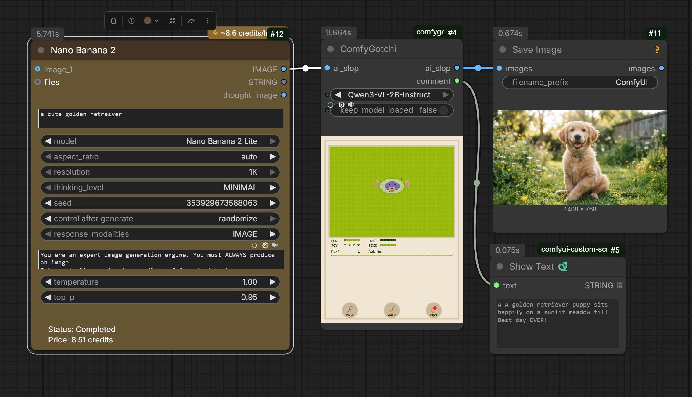
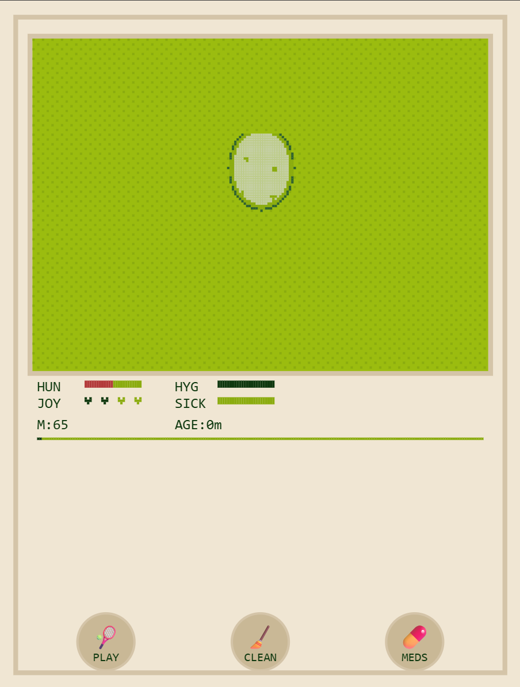
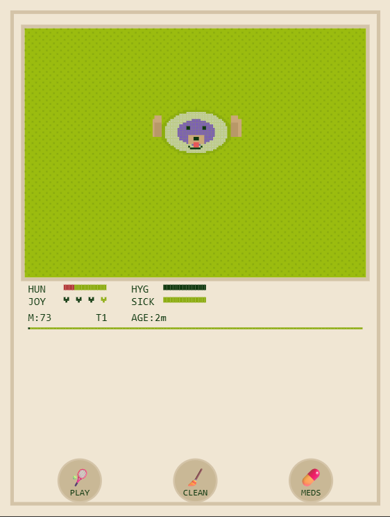
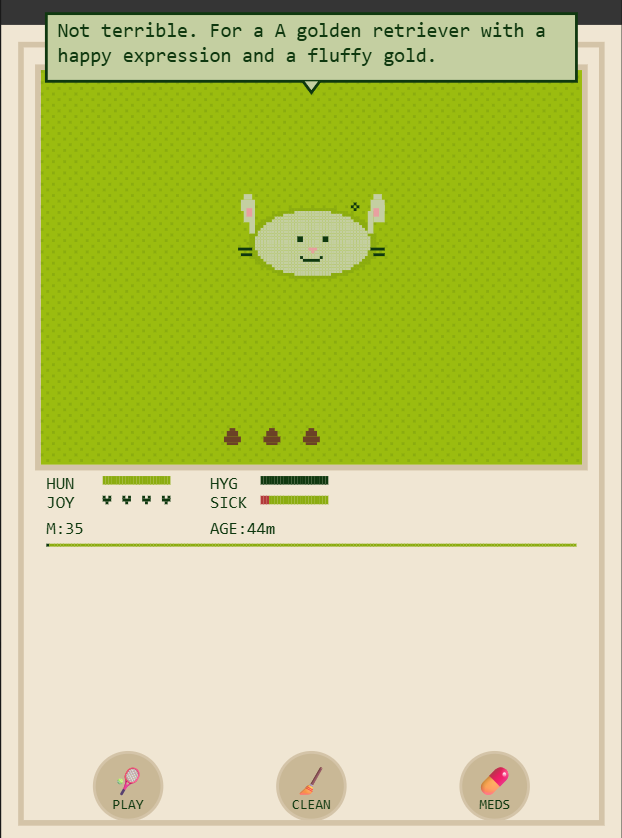
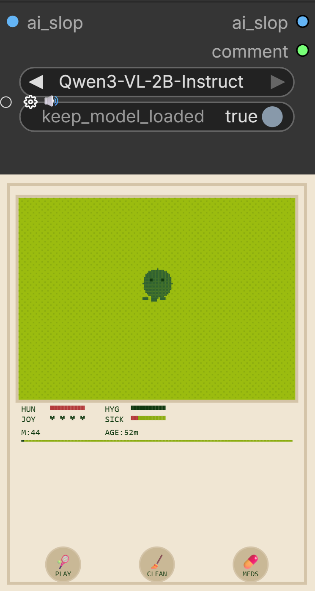

# ComfyGotchi

A Tamagotchi that lives inside ComfyUI and feeds on your AI slop.



## Lore

In the murky depths of your GPU, a tiny creature stirs inside its egg. It doesn't eat pixels — it eats **AI slop**. Every generated image you pipe through ComfyUI is devoured by your ComfyGotchi. The first 10 images you feed it during incubation **define what it becomes**: a dog? a dragon? a robot? The aesthetic of your slop imprints on its personality forever.

Feed it well and it grows. Neglect it and it gets hungry, bored, sick, and eventually dies — reincarnating as a new egg from the ashes of your discarded generations.

Your ComfyGotchi thrives on creative energy. Every time you use a **ComfyUI Partner API node** (Gemini, Kling, OpenAI, Recraft, Luma, and 200+ others), your creature feels the love and gets happier. Using premium API nodes is the fastest way to keep it joyful.

Your ComfyGotchi has opinions about your slop. It will comment on what you feed it, with attitude shaped by the aesthetic of those first 10 incubation images. Dark and moody slop produces a snarky creature. Bright and colorful slop produces a cheerful one.

## Lifecycle

| Stage | Image |
|-------|-------|
| **Egg** — Incubating. Feed it 10 images to hatch. |  |
| **Hatchling** — Just hatched! Small and hungry. |  |
| **Adult** — Fully grown. Comments on your slop. |  |
| **Ghost** — It died. Reincarnates after ~2 minutes. |  |

## The 10 Variants

The first 10 images you feed determine which creature hatches. Keyword detection on the VLM captions ensures reliable classification.

| Variant | Hatches from slop containing... |
|---------|------|
| dog | dogs, puppies, retrievers, huskies... |
| cat | cats, kittens, tabbies... |
| bunny | rabbits, hares... |
| dragon | dragons, lizards, reptiles... |
| robot | robots, androids, cyber... |
| monster | monsters, demons, beasts... |
| alien | aliens, extraterrestrials... |
| phantom | ghosts, spirits, shadows... |
| penguin | penguins, birds, arctic... |
| blob | anything unrecognizable (default) |

## How It Works

- **Feeds on AI slop** — pipe an IMAGE (your generations) through the ComfyGotchiNode. The creature eats and a local VLM (Qwen3-VL) generates a comment.
- **First 10 images = identity** — the first 10 images fed during the egg phase determine the creature's variant and personality tone. Keyword-based detection on the VLM captions ensures reliable classification.
- **Feels love** — when a ComfyUI API node (Gemini, Kling, OpenAI, etc.) executes, the creature's happiness rises.
- **Gets hungry over time** — hunger, boredom, hygiene decay passively while ComfyUI runs.
- **Poops** — yes. Clean it up or it gets sick.
- **Evolves** — after every 50 images eaten cumulatively, the creature mutates into a new form.
- **Dies and reincarnates** — if sickness or hunger reaches 100, it becomes a ghost. After ~2 minutes, it reincarnates as a fresh egg.
- **Persists** — state survives restarts via `state.json`.

## Personality Tones

The aesthetic of your first 10 slop images imprints a personality:

| Slop aesthetic | Tone |
|---------|------|
| dark, moody, gothic, noir | snarky |
| bright, colorful, happy | cheerful |
| nature, organic, natural | calm |
| sci-fi, cyber, tech | robotic |
| cute, kawaii, soft | gentle |
| horror, scary, creepy | morbid |

## Installation

Drop this folder into `custom_nodes/` and restart ComfyUI.

## Usage

```
KSampler → VAE Decode → ComfyGotchiNode → Save Image
```

Wire the `comment` STRING output to a Display Text or Save node to see the creature's remarks about your slop.

An example workflow is included in [`workflow/example workflow.json`](workflow/example%20workflow.json).


## Care

- **Feed** it AI slop (pipe images through the node)
- **Play** with it (PLAY button 🎾)
- **Clean** its poop (CLEAN button 🧹)
- **Medicine** when sick (MEDS button 💊)
- **Love** happens automatically when API nodes execute

## Reset

To reset your Tamagotchi back to an egg:

```bash
curl -X POST http://127.0.0.1:8188/comfygotchi/reset
```
